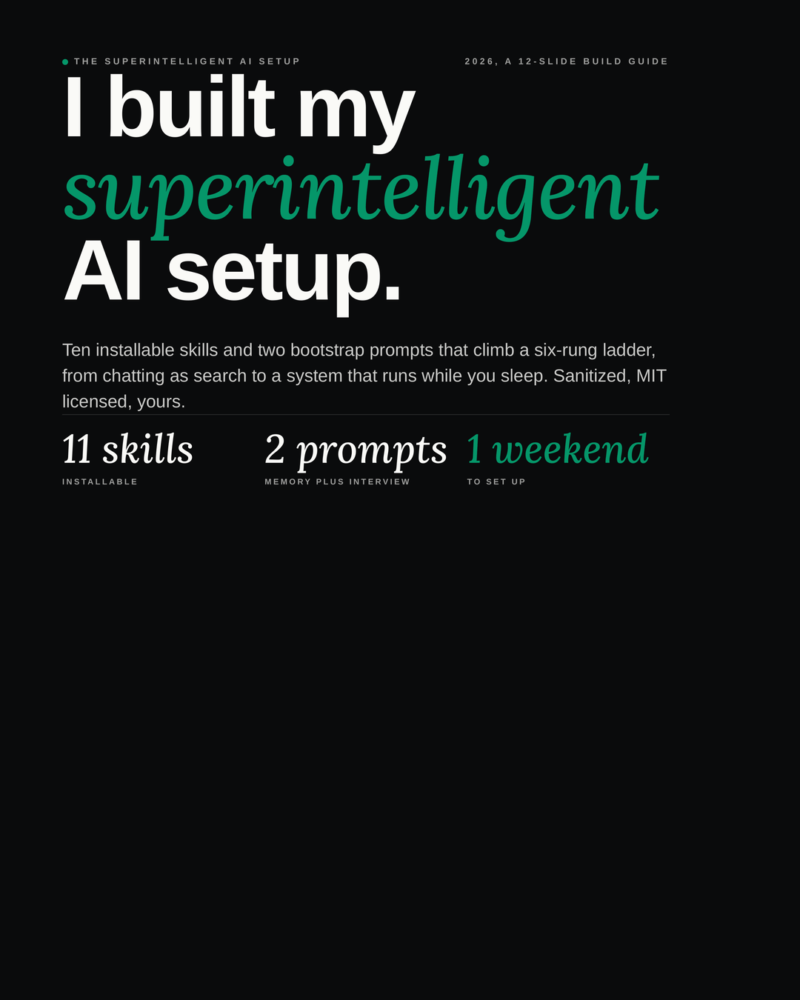
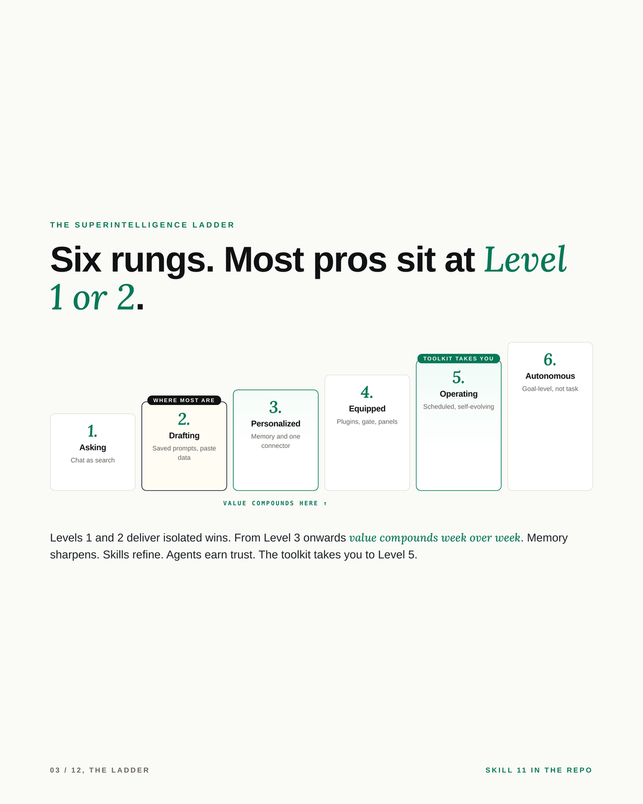
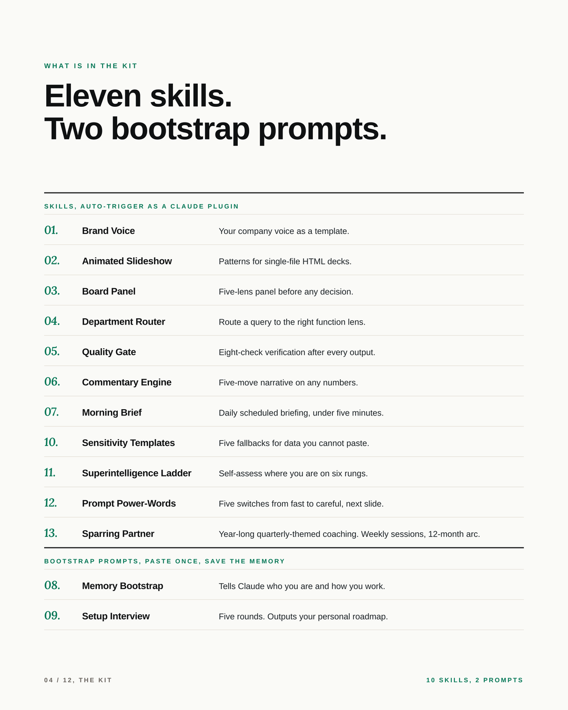
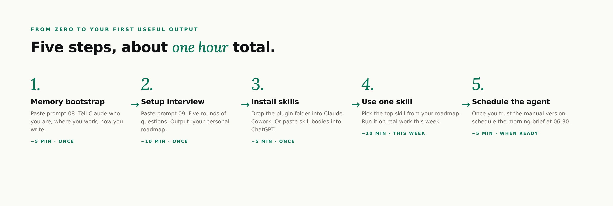
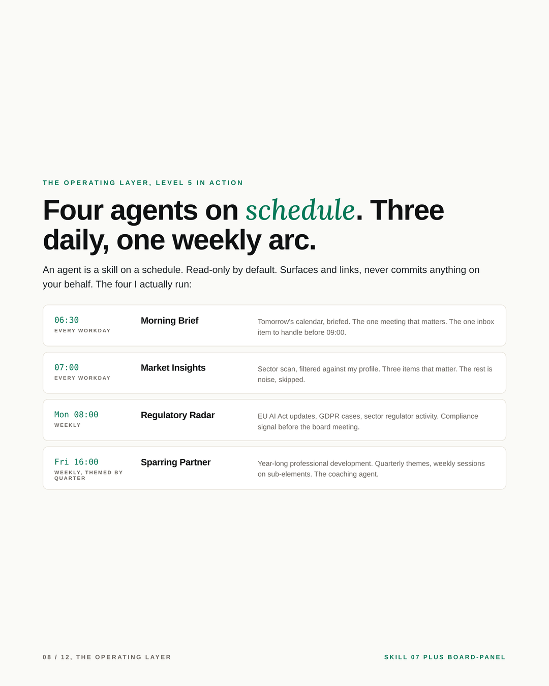

# Superintelligent AI Toolkit

> The carousel above plays through the full twelve-slide build guide. [Download the PDF](./assets/superintelligent-ai-carousel.pdf) for sharing or offline reading. The [MP4 version](./assets/carousel.mp4) is the same content as a video file.

Ten installable skills, two bootstrap prompts, and one ladder that takes you from chatting with AI like it is a search engine to a system that runs while you sleep. Tested in my own daily work. Sanitized for general use. MIT licensed.

## Is this for me?

**Yes if:** you have a Claude account (Pro, Max, or Enterprise, or Cowork) and a workweek full of meetings, decisions, writing, and reading. You do not need to be technical.

**After your first hour with this kit you will have:** a personal Profile of how you work, a roadmap of which skills fit your role, and your first installed skill producing output on real work.

**You will not need:** a developer, a vendor, a six-month transformation programme, or a paid platform stacked on top of Claude.

## The Superintelligence Ladder

Six rungs from chatting to autonomous. Most professionals sit at Level 1 or 2. From Level 3 onwards value compounds week over week, because memory sharpens, skills refine, and agents earn trust. This toolkit takes you to Level 5.

You climb one rung at a time. People who try to skip from 2 to 5 fall back to 1. The skill at `skills/11-superintelligence-ladder/SKILL.md` is the self-assessment so you can name where you are honestly before you plan the next move.

## What is in the box

Ten installable skills (auto-trigger as a Claude plugin, or paste into any LLM as a system instruction):

| # | Skill | What it does |
|---|-------|--------------|
| 01 | brand-voice | Your company voice as a template. Drop in placeholders, get consistent writing everywhere. |
| 02 | animated-slideshow | Battle-tested patterns for building polished single-file HTML slide decks. |
| 03 | board-panel | Convene a five-lens panel before any non-trivial decision. |
| 04 | department-router | Route a query to the right business function lens (Finance, Legal, IT, People, Ops, Sales, Strategy). |
| 05 | quality-gate | Eight-check verification policy that runs after any significant output. |
| 06 | commentary-engine | Five-move narrative on any numerical data. Lead with the insight, end with the action. |
| 07 | morning-brief | Daily scheduled briefing. News, peer moves, regulatory, calendar, risks. Under five minutes to read. |
| 10 | sensitivity-templates | Five fallback patterns for when the data cannot be pasted. |
| 11 | superintelligence-ladder | Six-level maturity model. Self-assess, plan the next move. |
| 12 | prompt-power-words | Five phrases that switch Claude from fast to careful: ultrathink, maxeffort, ultraplan, run the panel, critique yourself. |
| 13 | sparring-partner | Year-long professional development companion. Quarterly themes, weekly sessions. |

Two bootstrap prompts (paste once, save the memory):

| # | Prompt | What it does |
|---|--------|--------------|
| 08 | memory-bootstrap | Fill the placeholders. Tells Claude who you are, where you work, how you write. |
| 09 | setup-interview | Five rounds of interview that design your personal setup. Outputs: skills to install, connectors, scheduled tasks, stakeholders to loop in, first-month roadmap. |

## Order of operations

1. **Run `prompts/08-memory-bootstrap.txt`** in a fresh Claude conversation. Fill in the bracketed placeholders honestly. About five minutes. This is the single highest-leverage step in the whole setup.
2. **Run `prompts/09-setup-interview.txt`** in the same conversation. Five rounds of questions. Out comes your personal roadmap: which skills to install for your role, which connectors make sense, which scheduled tasks earn their keep, which stakeholders to loop in.
3. **Install the skills your roadmap recommends.** Plugin install on Claude Cowork puts the whole bundle in place automatically. ChatGPT / Copilot / generic LLM paths in `docs/install.md`.
4. **Use one skill on real work this week.** Pick the top one from your roadmap. Add a second one next week. Resist the urge to install all eleven at once.
5. **Schedule `morning-brief`** (skill 07) when you trust the manual version. That is your first scheduled task. Once it runs reliably, add the next agent.

## Who this is for

Any business professional with a calendar, an inbox, and decisions to make. Concrete examples by role, using only skills that exist in this repo:

- **Product manager:** `board-panel` on roadmap forks. `commentary-engine` on metric readouts. `brand-voice` for the Slack ping nobody wants to send.
- **Sales director:** `morning-brief` on tomorrow's calls. `board-panel` before negotiating a key renewal. `brand-voice` for the "we missed the quarter" email.
- **Finance manager (not the CFO):** `commentary-engine` on month-end variance. `sensitivity-templates` on actuals not yet published. `quality-gate` before submitting to the controller.
- **In-house counsel:** `board-panel` on policy decisions. `department-router` for cross-functional triage. `sensitivity-templates` as the default for any personal data of others.
- **Anyone on a development arc:** `sparring-partner` as the year-long coaching agent. Set a quarterly theme, run weekly sessions, review at quarter end.
- **Founder, consultant, designer, engineer:** the kit is role-agnostic; the templates work once you fill in the placeholders.

## What runs while you sleep

An agent is just a skill on a schedule. Read-only by default. Surfaces and links, never commits anything on your behalf. The four I actually run are above. You design yours via the setup interview in step 2.

## The principle

Climb one rung at a time. Memory before skills. Skills before agents. People who try to skip levels fall back to where they started.

## Privacy and data flow

By default the kit is read-only. Skills surface and structure information; they do not write to your systems. Your filled-in memory bootstrap and setup-interview answers stay in your private project knowledge, not in this repo. The `.gitignore` already blocks `my-profile.md` and the filled-in bootstrap files from being committed by accident.

For executives in regulated industries, `docs/governance.md` covers the tier choice (consumer versus enterprise), the MNPI line, connector scope hygiene, the EU AI Act May 2026 note, and the five-question email to send to your CISO before you connect anything.

## Install paths

| If you are on | Install path |
|----------------|--------------|
| Claude Cowork | Plugin install, recommended. Drop the repo folder into `~/Library/Application Support/Claude/plugins/` (macOS) or `%APPDATA%\Claude\plugins\` (Windows). |
| ChatGPT (Pro/Plus/Enterprise) | Each SKILL.md body becomes a Custom GPT. Upload `my-profile.md` as knowledge. |
| Microsoft Copilot for Microsoft 365 | Each SKILL.md body becomes a Copilot Studio agent. |
| Generic LLM (Gemini, Mistral, local) | Paste each SKILL.md body as a saved system instruction. Attach the filled-in memory bootstrap at the start of every conversation. |

Full instructions in `docs/install.md`. If `git clone` is not your thing, `docs/install.md` has a no-terminal path that takes three minutes.

## Open-source projects I run alongside

Pick one of these per layer:

- **Memory:** Mempalace (file-based, self-hosted, what I run), Mem0 (hosted, lower friction), Letta (full memory framework, dev-heavier).
- **Prompt patterns library:** [fabric](https://github.com/danielmiessler/fabric) by Daniel Miessler. The best curated library on the internet. Cold-start inspiration when you build a new skill.
- **Multi-model routing:** [LiteLLM](https://github.com/BerriAI/litellm). One API, every major LLM.
- **Self-hosted chat UI:** [Open WebUI](https://github.com/open-webui/open-webui). For private models.

Full notes in `docs/open-source-stack.md`.

## Acknowledgments

This setup borrows from, builds on, and credits:

- The Anthropic Skills format (the `SKILL.md` with YAML frontmatter pattern).
- Gary Klein's pre-mortem method (HBR, 2007), referenced by the `board-panel` skill.
- The Tiger / Paper Tiger / Elephant risk taxonomy, a popular reformulation of pre-mortem categorisation.
- The `fabric` project by Daniel Miessler.
- The memory tools that make all of this work: Mempalace, Mem0, Letta.

If something here is yours and I have missed credit, open an issue and I will fix it.

## License

MIT. Use it. Fork it. Remix it. PRs welcome if you s